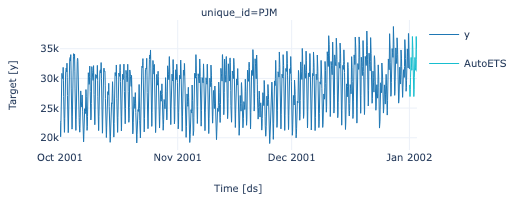

# Automate Time Series Forecasting with TimeCopilot's LLM-Powered Model Selection

Forecasting has progressed from statistical models like ARIMA and ETS to tools like Prophet and LightGBM, and now to foundation models like Amazon Chronos, Google TimesFM, and Salesforce Moirai.

While more options can improve forecast quality, they also increase complexity. Evaluating them requires installing multiple libraries, adapting data to different APIs, running cross-validation, and comparing results before generating a single prediction.

In this article, you will see how TimeCopilot simplifies this process into a single call that:

- Benchmarks statistical and foundation models side by side
- Uses an LLM to select the best model for your data
- Explains why that model was chosen

<!-- more -->

## The Forecasting Landscape

Before diving into code, here's a quick overview of the model families TimeCopilot supports.

- **Statistical models** like AutoARIMA, AutoETS, and Theta are fast, interpretable, and fit directly from the target series. **Prophet** extends this with built-in handling of daily, weekly, and yearly seasonality plus missing data.
- **ML and neural network models** like AutoLGBM, AutoNHITS, and AutoTFT capture nonlinear patterns and long-range dependencies through gradient boosting and deep learning architectures.
- **Foundation models** like Chronos, TimesFM, Moirai, Toto, and TimeGPT are pretrained on millions of diverse time series and can forecast without task-specific training.

TimeCopilot also integrates with sktime, giving you access to 200+ additional models through a unified API.

Each family has trade-offs, and the best choice depends on your data's characteristics: trend strength, seasonality patterns, noise level, and series length. Figuring this out manually for every new dataset is where most of the effort goes.

That's what TimeCopilot automates. In the sections that follow, you'll first see what the manual process looks like, then how TimeCopilot replaces it with a single call.

## Setup

Start by installing TimeCopilot:

```bash
pip install timecopilot
```

*This article uses timecopilot v0.0.24.*

TimeCopilot uses an OpenAI API key for LLM reasoning. Add it to a `.env` file:

```bash
OPENAI_API_KEY="your-api-key"
```

And load it with:

```python
from dotenv import load_dotenv
load_dotenv()
```

Load the PJM Hourly Energy Consumption dataset and use the last 3 months. This gives us hourly data with daily and weekly seasonality patterns, making it a good test for automated model selection.

```python
import pandas as pd

df = pd.read_csv(
    "https://raw.githubusercontent.com/panambY/Hourly_Energy_Consumption/master/data/PJM_Load_hourly.csv",
    parse_dates=["Datetime"],
)

# Use the last 3 months
df = df.sort_values("Datetime")
df = df[df["Datetime"] >= "2001-10-01"].reset_index(drop=True)

print(df.head())
```

```text
Datetime  PJM_Load_MW
0 2001-10-01 00:00:00      22827.0
1 2001-10-01 01:00:00      21478.0
2 2001-10-01 02:00:00      20543.0
3 2001-10-01 03:00:00      20205.0
4 2001-10-01 04:00:00      20163.0
```

TimeCopilot expects a DataFrame with three columns: `unique_id`, `ds`, and `y`. Rename the columns and add the series identifier:

```python
df = df.rename(columns={"Datetime": "ds", "PJM_Load_MW": "y"})
```

Some foundation models (like Moirai) require uniformly spaced timestamps. This dataset has a one-hour gap, so fill it with interpolation:

```python
df = df.sort_values("ds").set_index("ds").asfreq("h").interpolate().reset_index()
df["unique_id"] = "PJM"

print(f"Shape: {df.shape}")
print(f"Date range: {df['ds'].min()} to {df['ds'].max()}")
```

```text
Shape: (2209, 3)
Date range: 2001-10-01 00:00:00 to 2002-01-01 00:00:00
```

Let's visualize the data to see the patterns we're working with:

```python
from timecopilot.models.utils.forecaster import Forecaster

Forecaster.plot(df=df, engine="plotly")
```



## Manual Comparison Across Models

A [foundation model](https://timecopilot.dev/api/models/foundation/models/) for time series is a large neural network pretrained on diverse datasets so it can forecast new series without retraining. TimeCopilot supports several leading foundation models, each promising strong zero-shot accuracy:

- **Chronos** (Amazon)
- **Moirai** (Salesforce)
- **TimesFM** (Google)
- **Toto** (Datadog)
- **TimeGPT** (Nixtla)

But each model has its own library, API, and output format. Let's see what that looks like in practice:

### Chronos

Chronos takes a raw PyTorch tensor and outputs multiple forecast samples per step. You'll need to reduce them (e.g. via median) to get a single prediction:

```python
import torch
from chronos import ChronosPipeline

pipeline = ChronosPipeline.from_pretrained("amazon/chronos-t5-small", device_map="auto")
context = torch.tensor(df["y"].values[-512:])
chronos_forecast = pipeline.predict(context, prediction_length=48)

chronos_median = chronos_forecast.median(dim=1).values.squeeze().numpy()
print(chronos_median[:5])
```

```text
[29529.867 28641.75  28197.693 28197.693 28641.75 ]
```

### Moirai

Moirai is built on GluonTS and uses a completely different stack. You have to wrap your DataFrame in a GluonTS `PandasDataset`, construct the forecast model with explicit patch and context settings, and iterate over forecast objects to extract values:

```python
import numpy as np
from gluonts.dataset.pandas import PandasDataset
from uni2ts.model.moirai import MoiraiForecast, MoiraiModule

moirai_df = df.set_index("ds")[["y"]]
ds = PandasDataset(dict(PJM=moirai_df), target="y")

model = MoiraiForecast(
    module=MoiraiModule.from_pretrained("Salesforce/moirai-1.0-R-small"),
    prediction_length=48,
    context_length=512,
    patch_size=16,
    num_samples=100,
    target_dim=1,
    feat_dynamic_real_dim=0,
    past_feat_dynamic_real_dim=0,
)

predictor = model.create_predictor(batch_size=32)
moirai_forecasts = list(predictor.predict(ds))
moirai_median = np.median(moirai_forecasts[0].samples, axis=0)
print(moirai_median[:5])
```

```text
[30253.531 30284.766 30945.984 30687.44  30284.766]
```

### The reconciliation problem

Now you have two forecasts that don't agree:

- Chronos predicts demand will drop over the next few hours
- Moirai predicts demand will stay elevated or rise
- The two models disagree on both the magnitude and direction of the forecast

Which one should you trust? You might be tempted to:

- **Average them**, which drags accurate forecasts toward inaccurate ones instead of letting the better model win
- **Pick by intuition**, but there's no way to verify your choice is right, and a worse model can easily look more convincing than the better one

Neither approach works.

The right approach is to let past performance decide which model to trust. Manually, that looks like:

1. Run time series cross-validation for each model on historical folds
2. Calculate error metrics (MAE, RMSE, MASE) across folds
3. Determine which model performed best on your data
4. Re-fit the winning model on the full dataset

And that's just for two foundation models. The work grows with every new candidate you want to evaluate, whether it's another foundation model or a classical statistical one.

## TimeCopilot's Automated Approach

TimeCopilot does all of this in one call. It cross-validates your models, picks the best one by accuracy, and explains why, using a single interface that works for both foundation and classical models.

Let's see it in action. If you're running in a Jupyter notebook, apply `nest_asyncio` first:

```python
import nest_asyncio
nest_asyncio.apply()
```

Then run the forecast:

```python
from timecopilot import TimeCopilot
from timecopilot.models import AutoETS, DynamicOptimizedTheta
from timecopilot.models.foundation.chronos import Chronos
from timecopilot.models.foundation.moirai import Moirai

tc = TimeCopilot(
    llm="openai:gpt-4o",
    retries=3,
    forecasters=[
        AutoETS(),
        DynamicOptimizedTheta(),
        Chronos(repo_id="amazon/chronos-bolt-small"),
        Moirai(repo_id="Salesforce/moirai-1.0-R-small"),
    ],
)
result = tc.forecast(df=df, freq="h")
```


That's it. Behind the scenes, TimeCopilot automatically:

1. Extracts statistical features from the time series (trend strength, seasonality, autocorrelation, entropy)
2. Runs cross-validation across the specified models: AutoETS, DynamicOptimizedTheta, Chronos, and Moirai
3. Compares performance metrics
4. Uses the LLM to interpret results and select the best model

Access the full analysis:

```python
print(result.output.tsfeatures_analysis)
```

```text
The PJM time series exhibits high seasonal strength with a detected period of 24 hours, typical for electrical load data following a daily pattern.

The series length is 2208 points, providing a substantial dataset. Trend strength is also notable, reflecting a persistent increase in energy usage over time.

The unit root test (PP) shows stationarity, suggesting that stationarity-inducing transformations are unnecessary.
```

Notice how the LLM goes beyond reporting numbers. It connects the 24-hour seasonality to the domain (electrical load patterns) and flags that no stationarity transforms are needed, saving you a preprocessing step.

## Model Selection

Check the raw MASE scores from cross-validation:

```python
print(result.eval_df)
```

```text
  metric   AutoETS  DynamicOptimizedTheta  Chronos    Moirai  SeasonalNaive
0   mase  1.099396                1.18132  0.65833  1.242788       1.104174
```

Lower MASE means better accuracy. A few things stand out:

- TimeCopilot automatically adds SeasonalNaive as a baseline benchmark, which is why it appears despite not being in our forecasters list.
- Chronos leads at 0.66, the only model below the SeasonalNaive baseline of 1.10.
- The statistical models and Moirai all score above the baseline, showing that foundation models don't always win.

See which model TimeCopilot selected:

```python
print(result.output.selected_model)
```

```text
Chronos
```

Stakeholders need more than a winner, they need to understand why. However, translating MASE scores into a clear narrative usually requires deep expertise. TimeCopilot's `model_comparison` handles this for you:

```python
print(result.output.model_comparison)
```

```text
In cross-validation, Chronos performed the best with a MASE of 0.658 compared to AutoETS (1.099), DynamicOptimizedTheta (1.181), Moirai (1.243), and SeasonalNaive (1.104).

Chronos's ability to accurately model multiple seasonalities made it superior, especially given the PJM data's clear cyclic daily patterns.

The other models, while capable of capturing single trends and less complex seasonality, weren't as efficient for the comprehensive pattern seen in the PJM data.
```

Instead of interpreting MASE scores yourself, you get a clear explanation of both the winning model and why the alternatives fell short. You can then use this to create a report or stakeholder presentation.

## Forecast Results

Visualize the forecast alongside the historical data:

```python
Forecaster.plot(df=df, forecasts_df=result.fcst_df, engine="plotly")
```


The plot shows only Chronos's forecast because TimeCopilot generates the final prediction using the selected model, not all candidates. The forecast (lighter line) extends beyond the historical data, continuing the daily consumption pattern that Chronos captured.

Access the forecast DataFrame for downstream use:

```python
print(result.fcst_df.head())
```

```text
unique_id                  ds  Chronos
0       PJM 2002-01-01 01:00:00  29824.0
1       PJM 2002-01-01 02:00:00  28800.0
2       PJM 2002-01-01 03:00:00  28288.0
3       PJM 2002-01-01 04:00:00  28160.0
4       PJM 2002-01-01 05:00:00  28672.0
```


## Ask Questions About the Forecast

TimeCopilot isn't limited to model selection. After running the forecast, you can ask natural language questions about the results:

```python
answer1 = tc.query("What is the expected peak energy consumption in the next 48 hours?")
print(answer1.output)
```

```text
The expected peak energy consumption in the next 48 hours for the "PJM" time series remains unchanged from the previous analysis. Based on the forecasted values provided, the peak value is 37,888.0.

If you're interested in visualizing these forecasts and seeing how they compare to actual data, I can generate a plot for you. Would you like to see that?
```

Since the agent remembers the conversation, you can ask follow-up questions without repeating context:

```python
answer2 = tc.query("Show me a plot of the forecast")
print(answer2.output)
```


The agent answers with specific numbers (peak of 37,888.0 MW) and responds to visualization requests by generating plots automatically. This lets you explore forecasts conversationally, going from data questions to visuals without writing additional code.

For more examples, see the [agent quickstart](https://timecopilot.dev/examples/agent-quickstart/#ask-a-question-about-the-future).

## Conclusion

Manually comparing AutoETS, DynamicOptimizedTheta, Chronos, and Moirai requires managing different libraries, data formats, and cross-validation pipelines. TimeCopilot consolidates this into a single call that benchmarks all candidates, selects the best model, and explains why it was chosen.

This ability allows you to both explore new datasets and use TimeCopilot in proThis makes it easy to both explore new datasets and integrate TimeCopilot into production workflows. For example:

- Quick baselines on new datasets
- Automated model selection in production pipelines
- Stakeholder-ready explanations of why a model was chosen
- Evaluating whether complex models justify their cost over simpler alternatives
- Generating visualizations on demand for presentations
- Interactive exploration of time series patterns and anomalies

Get started with TimeCopilot on [GitHub](https://github.com/TimeCopilot/timecopilot).
